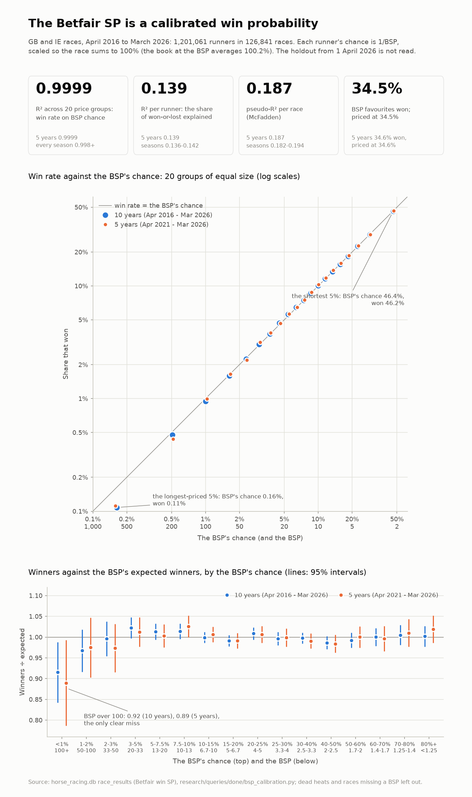

# How well the Betfair SP prices the winner (7 Oct 2026)

The owner's question: how accurate is the BSP as a win probability over the last 5 or 10 years, and what is its R²?

**Short answer.** The BSP is a calibrated probability. When it says 10%, about 10% win, at every price from odds-on to
50/1, in every season since 2016. The R² depends on what it measures:

- **0.9999** across groups of runners at the same price. This is the measure of accuracy.
- **0.139** for each runner's win or loss.
- **0.187** for each race's winner.

The two lower figures do not mean the BSP is wrong. A race is decided once, so a horse given 30% loses 70% of the time.



**Data and method.**
- Every GB and IE race in `race_results` from April 2016 to March 2026 where every runner has a win BSP and there is
  exactly one winner: 1,201,061 runners in 126,841 races.
- 325 races are left out: dead heats and races missing a BSP.
- The holdout from 1 April 2026 is not read.
- Each runner's chance is 1/BSP, scaled so the race sums to 100%. Before scaling, the book at the BSP averages 100.2%,
  so the scaling barely changes anything.
- Query: `research/queries/done/bsp_calibration.py` (research query run 37602493306). Its output is in
  `reports/bsp_calibration.txt`.
- The chart is drawn by `scripts/bsp_calibration_chart.py`.

## The R², three ways

| | 10 years (Apr 2016 – Mar 2026) | 5 years (Apr 2021 – Mar 2026) | Range across the 10 seasons |
|---|---|---|---|
| **R² across 20 equal price groups**: the win rate against the BSP's chance | **0.9999** | **0.9999** | 0.9982 – 0.9995 |
| **R² per runner** (Efron): how much of won-or-lost the BSP explains | **0.139** | **0.139** | 0.136 – 0.142 |
| **Pseudo-R² per race** (McFadden): the winner's chance against equal chances | **0.187** | **0.187** | 0.182 – 0.194 |
| Brier score | 0.08134 | 0.08215 | 0.0774 – 0.0834 |
| Brier skill against equal chances | 12.1% | 12.1% | 11.9 – 12.4% |
| Exponent that best fits the winners (1 = the BSP's chances as they stand) | 0.998 | 1.000 | 0.983 – 1.008 |
| Share of its race's losers the winner was shorter than | 75.3% | 75.2% | 75.0 – 75.9% |
| BSP favourites: won / their average chance | 34.45% / 34.45% | 34.55% / 34.62% | 33.7 – 35.0% won |

**R² across groups (0.9999)** answers "how accurate is the BSP as a probability".
- Runners are sorted by the BSP's chance into 20 groups of equal size.
- Each group's win rate is compared with its average chance as it stands. No line is fitted.
- The BSP explains 99.99% of the variation in the groups' win rates.

**R² per runner (0.139)** is low because each race is decided once, not because the BSP misjudges the chances.
- For a calibrated forecast, this R² measures how decisive its chances are (resolution ÷ uncertainty in the Brier
  decomposition), not whether they are right.
- If the BSP's chances were exactly the true chances, it would still read about 0.14.
- A forecast can only raise it by being more decisive *and* still right.

**Pseudo-R² per race (0.187)** is the benchmark a model has to beat when added to the market (Benter's test).
- It is the same as the market's 0.188 in our first Benter test, on 2023–26 races.
- It is level with the Hong Kong public's odds in 2016–23 (0.186), against 0.13 in Benter's 1986–93
  (`reports/syndicate_papers.md`).
- Field sizes differ between Hong Kong and Britain and Ireland, so that comparison is approximate.

**The exponent (0.998 / 1.000)** shows there is no favourite–longshot bias overall.
- An exponent above 1 would mean favourites win more often than their price says.
- Raising the BSP's chances to that power and rescaling each race leaves them where they are.

## Where the BSP is off: only the extreme long shots

**Winners against the BSP's expected winners, by price band (95% intervals):**

| BSP's chance (BSP) | 10 years | 5 years |
|---|---|---|
| under 1% (over 100) | **0.92 (0.84 – 0.99)** | **0.89 (0.79 – 0.99)** |
| 1 – 2% (50 – 100) | 0.97 (0.92 – 1.02) | 0.97 (0.90 – 1.05) |
| 2 – 3% (33 – 50) | 1.00 (0.95 – 1.04) | 0.97 (0.92 – 1.03) |
| 3 – 5% (20 – 33) | 1.02 (1.00 – 1.05) | 1.01 (0.98 – 1.05) |
| 5 – 7.5% (13 – 20) | 1.01 (0.99 – 1.03) | 1.00 (0.98 – 1.03) |
| 7.5 – 10% (10 – 13) | 1.01 (1.00 – 1.03) | 1.03 (1.00 – 1.05) |
| 10 – 50% (2 – 10) | 0.99 – 1.01 | 0.98 – 1.01 |
| over 50% (under 2) | 0.99 – 1.00 | 1.00 – 1.02 |

- Below BSP 100, no band misses its expected winners by more than its interval allows. The 3–5% and 7.5–10% bands
  sit at the upper edge of theirs.
- **Over BSP 100 the BSP overrates the horses' chances.** The longest-priced 5% of runners had an average chance of
  0.16% (about BSP 600) and won 0.11% of the time.

**Backing every runner at the BSP** (£1 level stakes, returns before and after 2% commission on winnings):

| BSP | Runners (10 years) | 10 years | after 2% | 5 years | after 2% |
|---|---|---|---|---|---|
| 1 – 2 | 17,886 | −0.65% | −1.42% | +0.10% | −0.67% |
| 2 – 3 | 43,720 | −0.39% | −1.59% | −0.95% | −2.14% |
| 3 – 5 | 120,923 | −0.31% | −1.80% | −0.37% | −1.86% |
| 5 – 8 | 173,149 | −0.54% | −2.22% | +0.02% | −1.66% |
| 8 – 13 | 199,098 | +0.45% | −1.36% | +1.43% | −0.40% |
| 13 – 21 | 176,864 | +1.84% | −0.07% | +0.41% | −1.48% |
| 21 – 51 | 230,509 | +0.16% | −1.78% | −0.99% | −2.90% |
| 51 – 101 | 91,062 | −3.90% | −5.79% | −2.17% | −4.10% |
| 101 and over | 147,850 | −18.49% | −20.11% | −18.42% | −20.04% |

No price band makes a profit after commission in either window.

## What it means for the trading

The BSP alone leaves nothing to take. But because it is calibrated, beating it is the profit:
- A back matched at a price X% better than the BSP is worth about X% of the stake on average, before commission.
- That is why the live rule backs where the expected closing-line value (CLV) against the BSP is at least 3%. Its
  results are measured the same way, by CLV at Betfair's settled price.
- The one region where the BSP is reliably wrong, over 100, is where nobody should back at the BSP.

## Reproduce

```bash
python research/queries/done/bsp_calibration.py > reports/bsp_calibration.txt   # needs horse_racing.db
python scripts/bsp_calibration_chart.py --txt reports/bsp_calibration.txt --out reports/bsp_calibration.png
```

The query labels the 5–7.5% band "5.0%-8%". This is a rounding in the label only.
